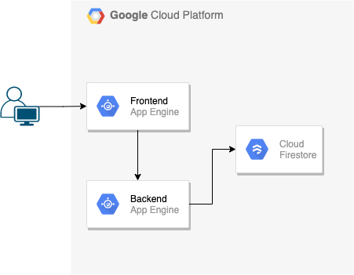

# rakuten_f2e

## Demo
https://rakuten-f2e.ccclin.tk/

## Architecture


## Tools
- Backend: golang
- Frontend: Vuejs 3
- Database: Google Firestore

## Before Start
1. create a GCP GAE service
2. enable GCP Firestore
3. create a service account with role GCP datastore admin for GCP Firestore
4. install `gcloud` SDK on your lab
5. install `yarn` on your lab
6. install `golang` on your lab

## On development
### Backend
1. change GCP project
```
$ gcloud config set project <GCP_PROJECT_ID>
```
2. enable service account for GCP Firestore
```
$ gcloud auth activate-service-account --key-file=<SERVICE_ACCOUNT_KEY_JSON>
```
3. start backend
```
FIRESTORE_PROJECT=<GCP_PROJECT_ID> ORIGIN_ALLOWED="http://localhost:8081"  go run ./main.go
```
which `http://localhost:8081` is allowed CORS domain

### Frontend
1. go to frontend folder
```
$ cd ./rakuten_f2e_frontend
```
2. install yarn tools
```
$ yarn install
```
3. start frontend
```
$ yarn run serve --port 8081
```

## Deploy
1. Build Frontend
```
$ cd ./rakuten_f2e_frontend
$ yarn run build
```
2. Edit `app.yaml` and deploy to GAE
```
$ gcloud app deploy app.yaml
```
